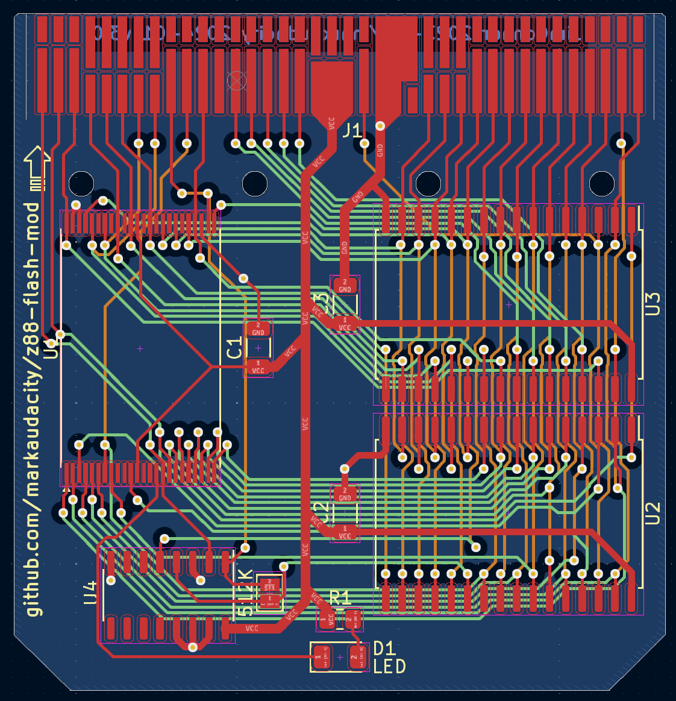
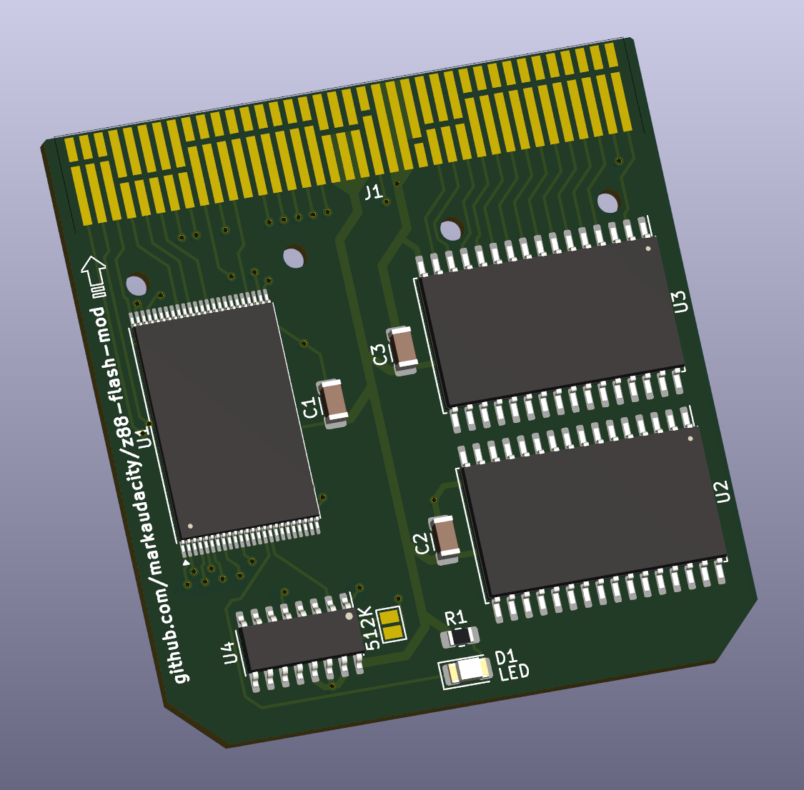

# z88-flash-mod

An open-source expansion card for the Cambridge Z88 which can be configured as 512KB RAM, 1MB RAM or 1MB Flash. 
This is an updated version using a currently-available (as of early 2025) flash chip, as neither the original part used (an AM29F080) nor a pin-compatible part are available new. Originally created by Jim Connor, with groundwork by XavSnap. Please see upstream for notes on the original design.

This work is based upon the Z88 connector design shared by XavSnap at [SinclairZXWorld Z88 Forum](https://sinclairzxworld.com/viewtopic.php?f=24&t=4431) - Thank you XavSnap!

# Current Status
This commit is the untested, modified version of the v3.0 card. It should work as-is, as the circuit is unchanged with the exception of the pinout of the new part, but I have not etched a board or built a prototype yet, so this should be considered alpha hardware that may break your Z88, sleep with your wife, burn down your house, and all kinds of mean, ugly, nasty things besides.

# What's Been Done
- schematic updated for currently-available TSOP-48 8Mbit flash chip
- PCB layout reworked for same, including cleaning up trace routing, reducing the number of vias, and general neatening and tidying
- symbol and footprint added for JEDEC-standard AM29F800-compatible part in TSOP-48 I package
- URL and maker names updated to point to this repository
